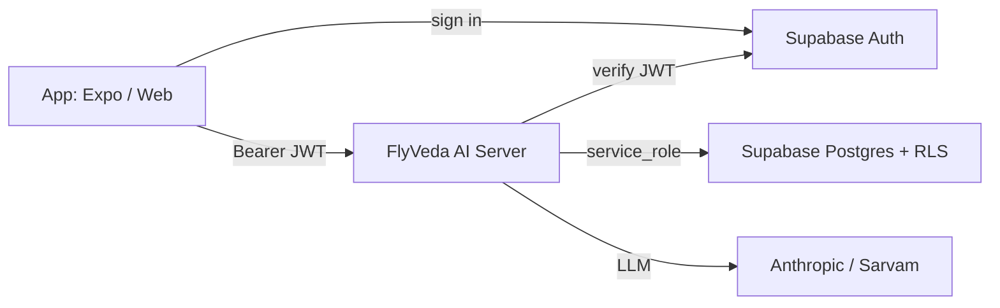

# FlyVeda AI Server

The AI layer for the FlyVeda app — a standalone, provider-agnostic backend that powers:

1. **AI Teacher** — an aviation ground-instructor chat that grounds every answer in the FlyVeda syllabus and returns the topics it cited.
2. **Question Bank** — generates exam-style MCQs per syllabus topic and explains answers (the monetizable wedge).

It's a plain HTTP service, so your Expo/React Native app **and** the website call the same endpoints.

## Why it's built this way

- **Provider-agnostic by design:** all LLM calls go through one `LLMProvider` interface (`src/llm/types.ts`). The active provider is chosen by `LLM_PROVIDER` and resolved from a registry in `src/llm/client.ts`. **Claude (Anthropic) is the default.** Adding Sarvam or Llama later is a new file + one registry line — services and routes never change.
- **Grounded, not a raw wrapper:** `src/syllabus/syllabus.ts` is a curated aviation taxonomy (DGCA/ground-school subjects → topics). Answers and questions are anchored to topic codes (e.g. `NAV.3`). This is the defensible layer — swap the keyword retriever for vector RAG over licensed content later without touching the services.
- **Guardrails baked into prompts:** stays on-aviation, flags authority-dependent regs (DGCA/FAA/EASA), and refuses to invent regulatory figures.

## Setup

```bash
cd ai-server
npm install
cp .env.example .env   # then fill in ANTHROPIC_API_KEY + Supabase keys
npm run dev            # http://localhost:8787
```

The server runs without a database (AI endpoints work; persistence and per-user
features are simply disabled). Set the Supabase variables below to turn on auth,
history, the question bank, progress tracking, and rate limiting. `GET /health`
reports `"database": "supabase"` once it's configured.

## Database & Auth (Supabase)

This server is the single backend the app talks to. The app signs in with
Supabase Auth, gets a JWT, and sends it as `Authorization: Bearer <jwt>` on each
request. The server verifies the token, then reads/writes Postgres in one of two
modes (auto-selected from your env):

- **service_role mode** (recommended for production): set `SUPABASE_SERVICE_ROLE_KEY`.
  The server bypasses RLS and scopes every query by user itself.
- **anon mode**: set only `SUPABASE_ANON_KEY`. The server forwards each user's JWT
  to Supabase so **RLS enforces** that users only touch their own rows. Use this
  if you only have the anon key (e.g. a project created by Lovable).

RLS is enabled on every table in both modes. `GET /health` reports the active
`databaseMode`.



### One-time database setup

1. Use your existing Supabase project (or create one).
2. Apply the schema in [`supabase/migrations/`](supabase/migrations) — either paste
   it into the Supabase SQL Editor, or with the CLI:
   ```bash
   supabase link --project-ref <your-ref>
   supabase db push
   ```
   The migration is **non-destructive**: it uses `create table if not exists`,
   only adds a `goal` column to `profiles` if missing, and installs the signup
   trigger only if no insert trigger already exists on `auth.users` — so it will
   not clobber a `profiles` table or trigger a tool like Lovable already created.
3. Copy the project URL + key(s) (Project Settings -> API) into `.env`:
   - `SUPABASE_URL` (required)
   - `SUPABASE_ANON_KEY` (required)
   - `SUPABASE_SERVICE_ROLE_KEY` (optional; enables service_role mode)

### Tables

`profiles`, `chat_sessions`, `chat_messages`, `questions` (question bank),
`quiz_attempts`, `topic_progress`, and `usage_events` (drives usage metrics +
rate limiting). A trigger auto-creates a `profiles` row on signup.

### Auth on endpoints

- **Optional auth** (works anonymously, persists when signed in): `POST /teacher`,
  `/questions/generate`, `/questions/explain`, `/generate-mcqs`,
  `/explain-answer`, `/detect-subject`.
- **Required auth** (401 without a valid token): `/quiz/attempt`,
  `/questions/unseen`, `/chats`, `/chats/:id`, `/progress`, `/usage`.
- **Public**: `/health`, `/syllabus`.

Authenticated requests are rate limited per user
(`RATE_LIMIT_MAX_REQUESTS` per `RATE_LIMIT_WINDOW_SECONDS`, default 30/60s).

### Adding a provider later (Sarvam / Llama)

1. Create `src/llm/providers/<name>.ts` exporting a factory that returns an `LLMProvider`.
2. Register it in the `PROVIDERS` map in `src/llm/client.ts`.
3. Set `LLM_PROVIDER=<name>` and that provider's key in `.env`.

## Endpoints

All under `/api/ai`.

### `POST /teacher` — AI Teacher
```jsonc
{
  "messages": [{ "role": "user", "content": "Explain how a jet engine produces thrust" }],
  "goal": "CPL",          // optional: PPL | CPL | ATPL | DGCA
  "stream": true           // default true (SSE); false returns one JSON
}
```
- **Streaming (default):** Server-Sent Events — `meta` (citations) → many `delta` (text) → `done`.
- **Non-streaming:** `{ "answer": "...", "citations": [{ topicCode, topicTitle, subjectName, ... }] }`

### `POST /questions/generate` — make practice questions
```jsonc
{
  "topicCode": "NAV.3",    // or "topic": "free text"
  "goal": "CPL",
  "count": 5,               // 1–10
  "difficulty": "medium"    // easy | medium | hard
}
```
Returns `{ topic, questions: [{ question, options[4], correctIndex, explanation }] }`.

### `POST /questions/explain` — explain an answer
```jsonc
{
  "question": "…",
  "options": ["A", "B", "C", "D"],
  "correctIndex": 1,
  "selectedIndex": 3,       // optional — enables misconception-specific feedback
  "goal": "CPL"
}
```
Returns `{ "explanation": "…" }`.

### `GET /syllabus?goal=CPL` — taxonomy for onboarding/Library
Returns `{ subjects: [{ code, name, goals, topics: [...] }] }`.

### Persistence & account endpoints (require `Authorization: Bearer <jwt>`)

- `POST /quiz/attempt` — record an answered MCQ.
  ```jsonc
  { "question_id": "uuid?", "subject": "Meteorology?", "topic_code": "MET.1?",
    "selected_option": "B", "correct_option": "A" }
  ```
  Returns `{ attempt, is_correct }` and updates `topic_progress` when subject + topic_code are given.
- `GET /questions/unseen?subject=Meteorology&limit=10` — previously generated questions the user hasn't attempted yet.
- `GET /chats` — the user's chat sessions (most recent first).
- `GET /chats/:id` — one session with its full message history.
- `GET /progress` — per-topic mastery + recent attempts.
- `GET /usage` — the user's own usage summary.

When signed in, `POST /teacher` persists the conversation and returns a
`sessionId` (pass it back on the next turn to continue the same chat), and the
MCQ generators save questions to the user's bank (responses include each
question's `id`).

### `GET /health`
Liveness + active model + whether the database is enabled.

## Quick test

```bash
curl http://localhost:8787/health

curl -X POST http://localhost:8787/api/ai/chat \
  -H "Content-Type: application/json" \
  -d '{"message":"What is QNH?"}'
```

## Deploy to Render

This is a **Node.js + Express** app. Render runs it as-is (no Supabase Edge Function rewrite).

1. Push this repo to GitHub (if it isn't already).
2. Go to [render.com](https://render.com) → **New** → **Blueprint** (or **Web Service**).
3. Connect the repo. Render reads [`render.yaml`](render.yaml) automatically if you use Blueprint.
4. In the Render **Environment** tab, set at minimum:
   - `ANTHROPIC_API_KEY` (or `SARVAM_API_KEY` + `LLM_PROVIDER=sarvam`)
5. Deploy. Render assigns a public URL like `https://flyveda-ai-server.onrender.com`.
6. Verify: `GET https://<your-service>.onrender.com/health`
7. In your Expo app, point the client at production once:
   ```typescript
   setBaseUrl("https://<your-service>.onrender.com");
   ```

**Notes**
- Render sets `PORT` automatically; the server reads it from the environment.
- Free tier spins down after ~15 min idle — first request after sleep can take ~30s (cold start).
- Supabase env vars are optional for now (chat works without them).
- Before going public, set `CORS_ORIGINS` to your app's origin instead of `*`.

## Where to go next

- Build the Expo/React Native (and web) client: wire Supabase Auth, then call these endpoints with the user's JWT.
- Replace the keyword retriever in `syllabus.ts` with embeddings/vector search once you have real content.
- Run Supabase advisors (`supabase db advisors` or the MCP `get_advisors`) after applying the migration and fix any findings before going to production.
- Consider a scheduled rollup of `usage_events` for billing/Startup India metrics.
